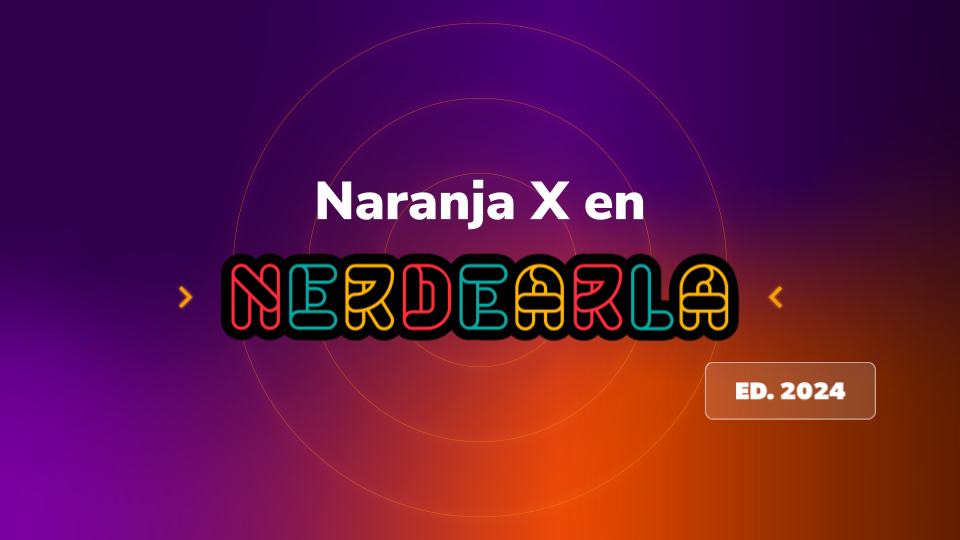
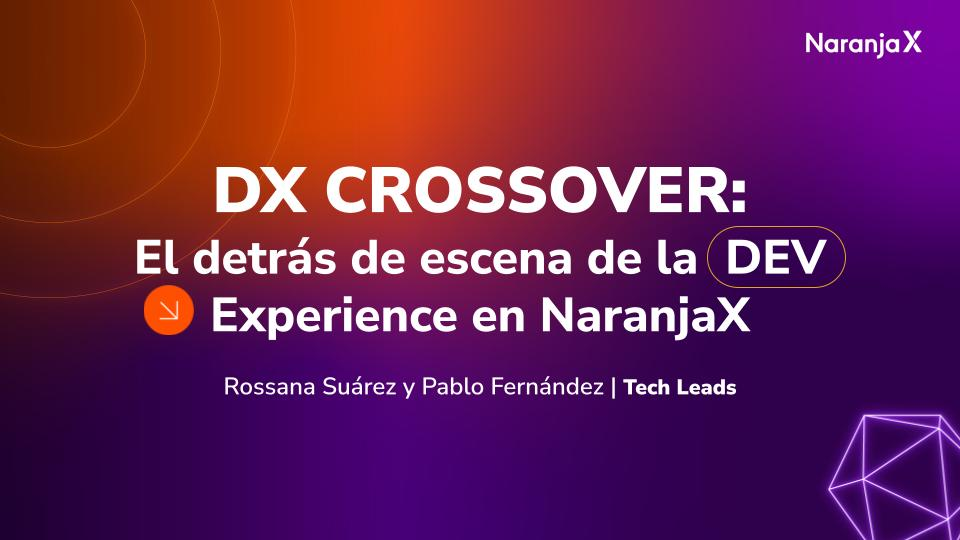

# Backstage Platform  by @roxsross


Este proyecto es una demostración de [Backstage](https://backstage.io/) 

Incluye lo siguiente,

- Configuraciones para ejecutar Backstage localmente con yarn dev, Docker y Kubernetes
- Recursos para implementar el proyecto en una cuenta de AWS utilizando Terraform
- Una template de demostración que se puede utilizar para crear un nuevo repositorio de Terraform IaC en una cuenta personal de GitHub (requiere que el usuario cree un Token de Acceso Personal).
- Una configuración de demostración de la API de Backstage

## Empezando

Tenga en cuenta que este proyecto es una demostración y no está destinado a ser utilizado en producción. El proyecto está pensado para ser utilizado como punto de partida para un nuevo proyecto de Backstage.

El proyecto base debería funcionar como se espera. Sin embargo, es posible que sea necesario solucionar algunos problemas para que el proyecto funcione en su entorno. Por favor, abra un problema si encuentra algún problema.

### Requisitos previos

- [Git](https://git-scm.com/downloads)
- [Node.js](https://nodejs.org/en/download/)
- [Yarn](https://classic.yarnpkg.com/en/docs/install/#mac-stable)
- [Backstage CLI](https://backstage.io/docs/getting-started/create-an-app)
- [Docker](https://docs.docker.com/get-docker/)
- [Kind](https://kind.sigs.k8s.io/docs/user/quick-start/)
- Cuenta de GitHub con un Token de Acceso Personal para crear repositorios (si desea utilizar la template de demostración para probar la creación de un nuevo repositorio)




### Ejecución local

1. Clonar el repositorio
  ```bash
  git clone https://github.com/roxsross/nx-nerdearla-backstage.git
  ```
2. Opcional: Crear un Token de Acceso de GitHub con permisos de escritura
  1. Iniciar sesión en GitHub
  2. Ir a Configuración > Configuración de desarrollador > Tokens de acceso personal
  3. Tokens (Clásico) > Generar nuevo token > Ingresar nombre + seleccionar el alcance "Repo"
3. Opcional: Agregar el Token de Acceso de GitHub para crear un nuevo repositorio a partir de una template de Backstage en GitHub
  ```bash
  # Opcional
  export GITHUB_TOKEN=aqui-va-el-token
  # Opcional si se ejecuta en Kubernetes 
  echo personal-access-token | base64
  # Actualizar el archivo `./local/kubernetes/backstage.yaml` con el token codificado en base64
  ```
4. Iniciar Backstage
  ```bash
  # Localmente
  cd app
  yarn install
  yarn dev

  # Localmente con Docker
  ./backstage.sh docker start
  # Abrir http://localhost:7007 en su navegador

  # Localmente con Kubernetes
  ./backstage.sh kubernetes start
  # Abrir http://localhost:7007 en su navegador
  ```

### Limpieza

```bash
# Docker
./backstage.sh docker stop

# Kubernetes
./backstage.sh kubernetes stop
```

## Implementación en AWS

### Requisitos previos

- [AWS CLI](https://docs.aws.amazon.com/cli/latest/userguide/install-cliv2.html)
- [Terraform](https://learn.hashicorp.com/tutorials/terraform/install-cli)
- [Cuenta de AWS](https://aws.amazon.com/premiumsupport/knowledge-center/create-and-activate-aws-account/)

### Implementación

El script ejecuta `terraform init` y `terraform apply` en los directorios `.terraform/backstage` y `.terraform/ecr`. Y ejecuta el script `./build_and_push_to_ecr.sh` para enviar una imagen de Docker al repositorio ECR del proyecto.

```bash
./backstage.sh terraform apply
```

### Limpieza

El script backstage.sh ejecuta `terraform destroy` en los directorios `.terraform/backstage` y `.terraform/ecr`.

```bash
./backstage.sh terraform destroy
```

## Objetivos del proyecto

### Backstage

- [x] Crear una aplicación de Backstage
- [x] Crear un template de Backstage que se pueda utilizar para crear un nuevo repositorio de IaC en mi cuenta personal de GitHub
  - Entidad del template: `./catalog/templates/template-terraform-s3.yaml`
  - Recursos del template: `./catalog/templates/terraform-s3/`
  - Template incluido en: `./backstage/app-config.yaml`
- [x] Crear un grupo, usuario, sistema y documentación de Backstage para pruebas

### Ejecución local

- [x] Implementar Backstage en un clúster local de Kubernetes con Kind
  - [x] Crear una imagen de Docker para Backstage
  - [x] `./local/kubernetes/README.md`: `./backstage.sh kubernetes start` && `./backstage.sh kubernetes stop`
- [x] Ejecutar Backstage con Docker y Docker Compose
  - [x] Crear una imagen de Docker para Backstage
  - [x] `./local/docker/README.md`: `./backstage.sh docker start` && `./backstage.sh docker stop`


